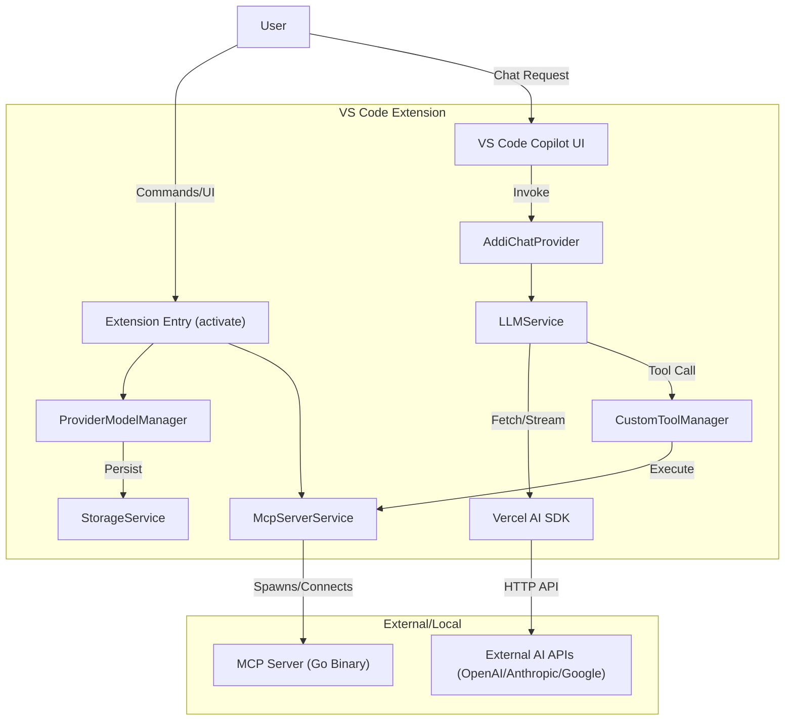

# Addi Project Design Document

## 1. Overview

Addi is a Visual Studio Code extension that enhances the Copilot experience by allowing users to bring their own AI providers (OpenAI, Anthropic, Google, etc.) and models. It also integrates with the Model Context Protocol (MCP) to support custom tools.

## 2. Architecture

The project consists of three main components:

1.  **VS Code Extension (TypeScript)**: The main interface and logic.
2.  **MCP Server (Go)**: A local server that executes custom tools, compliant with the Model Context Protocol.
3.  **UI/Views**: Tree views and editors for managing providers and models.

### Conceptual Flow

## 3. Key Components

### 3.1. Service Layer (`src/services/`)

- **`ProviderModelManager` (`src/provider.ts`)**: The central repository for AI providers and their models. Handles CRUD operations and persistence.
- **`LLMService` (`src/services/llmService.ts`)**: Handles the core chat logic. It creates a bridge between VS Code's Chat API and the Vercel AI SDK. It handles message conversion and tool execution.
- **`McpServerService` (`src/services/mcpServerService.ts`)**: Manages the lifecycle of the external Go-based MCP server. It handles downloading updates (via `McpDownloader`) and ensuring the binary is executable.
- **`CustomToolManager` (`src/services/customToolManager.ts`)**: Manages the definition of custom tools that can be invoked by the LLM.
- **`StorageService` (`src/services/storageService.ts`)**: Abstracts the underlying storage (VS Code `globalState` and `secretStorage` for API keys).

### 3.2. Utils

- **`McpDownloader` (`src/utils/mcpDownloader.ts`)**: robust utility for downloading the MCP server binary from GitHub releases, including checksum verification.

### 3.3. commands (`src/commands.ts`)

- Handles user interactions from the command palette and tree views.
- _Refactoring Note_: Currently contains heavy logic for fetching remote models which is being moved to `ProviderModelManager`.

## 4. external MCP Server (`mcp-server/`)

- Written in Go.
- Provides a local execution environment for tools.
- Communicates with the extension via Stdio (Standard Input/Output) adhering to the MCP specification.

## 5. Security Considerations

- **API Keys**: Stored in VS Code `SecretStorage` via `StorageService`.
- **Binary Execution**: The extension downloads and executes a binary. Integrity is verified via SHA256 checksums signed in the release.
- **Tool Execution**: Tools run locally via the MCP server. Users must explicitly enable/install tools.

## 6. Future Improvements

- Decouple `CommandHandler`.
- Implement more robust update mechanisms for the MCP server.
- Add support for more provider types dynamically.
